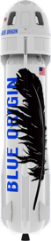

BlueOrigin - Mission New Shepard
================================

**BlueOrigin**
__________________

.. image:: _static/blueorigin_logo.png
    :align: center

Blue Origin est une entreprise aérospatiale axée sur l'exploration et la colonisation de l'espace. Son programme phare,
New Shepard, vise à offrir des voyages suborbitaux pour le tourisme spatial et la recherche scientifique. Grâce à un
puissant moteur réutilisable, le véhicule spatial propulse la capsule vers l'espace, offrant aux passagers une
expérience en apesanteur et une vue exceptionnelle de la Terre. Blue Origin aspire à un avenir où des millions de
personnes vivront et travailleront dans l'espace, préservant ainsi notre planète pour les générations futures.

**New Shepard**
_________________

Principaux objectifs :
    - Premier lanceur réutilisable de Blue Origin pour les vols suborbitaux
    - 6 passagers
    - Expérience de vol en apesanteur
    - Propulsion réutilisable
    - Tourisme spatial pour les passagers.
    - Expérience de vol en apesanteur.
    - Collecte de données scientifiques en microgravité.
    - Atterrissages verticaux réussis.

Mission :
    - Lieu de lancement : Van Horn, Texas, États-Unis.
    - Véhicule spatial réutilisable : Capsule et booster.
    - Capacité d'emport : Jusqu'à six astronautes ou combinaison passagers-charges utiles.
    - Propulsion : Moteur de fusée réutilisable BE-3.
    - Vol suborbital : Altitude pour l'expérience de l'apesanteur sans orbite.
    - Durée de vol : Environ 10-15 minutes, avec 3-4 minutes d'apesanteur.
    - Récupération : Atterrissage contrôlé du booster sur une plateforme, descente de la capsule avec parachutes.
    - Objectifs de recherche : Expériences scientifiques en microgravité.
    - Perspectives futures : Augmentation des vols, amélioration de la réutilisabilité et diversification des missions.